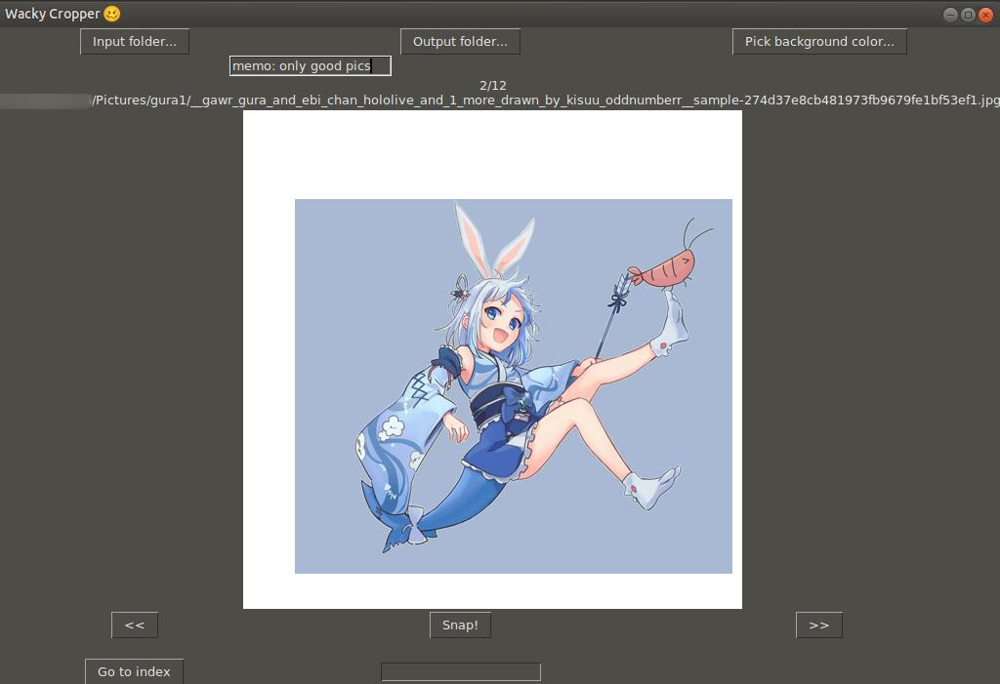

# Wacky Cropper 🥴

## Installation (Ubuntu)

`sudo apt install python3-tk python3-pil python3-pil.imagetk`

Hasn't been tested on Windows, but should probably work with `Pillow` package installed.

## Hotkeys

- <kbd>Space</kbd>: go to next picture
- <kbd>S</kbd>: snap (save cropped picture)
- <kbd>Q</kbd>: go to previous picture

## How to use

1. `python3 main.py`
2. In the window, click "input folder" to select an input folder with your images and "output folder" where the cropped images will be saved.
3. The first image will appear and you may begin working with dataset.
4. Drag the image with your mouse and press "Snap" or <kbd>S</kbd> when you're ready. The cropped image will be saved in output folder and the next image will be shown in the editor.

## Cropping to other resolutions

The 512x512 resolution is hardcoded for now, but it is easy to fix -- look for `TARGET_SIZE=512` constant in main.py and change it. Will add argparse in the future I promise

## Can I use this code?

MIT License or whaterver